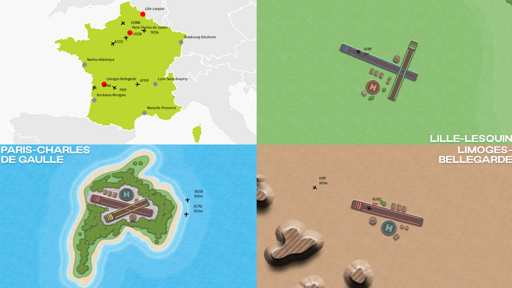

# AirportManager

## Modélisation (très) simplifiée du contrôle de la circulation aérienne

L’objet de ce projet est de modéliser un contrôle de la circulation aérienne. Suivant, le périmètre retenu, cette modélisation porte sur un territoire à l’échelle d’un pays ou autour des aérodromes/aéroports.

Les trois principaux Organismes du contrôle de la circulation aérienne sont (voir la page [Wikipedia](https://fr.wikipedia.org/wiki/Contr%C3%B4le_de_la_circulation_a%C3%A9rienne)) :

* Les [centres de contrôle régional](https://fr.wikipedia.org/wiki/Centres_de_contr%C3%B4le_r%C3%A9gional) (CCR) chargés d'assurer les services de la circulation aérienne au bénéfice des aéronefs en croisière (en dehors de la proximité d'aérodrome).

* Les [centres de contrôle d'approche](https://fr.wikipedia.org/wiki/Contr%C3%B4le_d%27approche) (APP) sont chargés d'assurer les services de la circulation aérienne aux abords d'un aérodrome, dans une zone de contrôle dont la taille est variable. Les [contrôleurs aériens](https://fr.wikipedia.org/wiki/Contr%C3%B4leur_a%C3%A9rien) sont situés soit dans la vigie d'une tour de contrôle, soit dans une salle [radar](https://fr.wikipedia.org/wiki/Radar_de_surveillance_d%27a%C3%A9roport) dédiée.

* Les [tours de contrôle d'aérodrome](https://fr.wikipedia.org/wiki/Contr%C3%B4le_d%27a%C3%A9rodrome) (TWR pour Tower ou tour de contrôle) sont chargées d'assurer les services de la circulation aérienne dans la circulation d'aérodrome.

Pour ce projet, il sera considéré que les contrôleurs aériens des tours de contrôle d’aérodrome ne géreront que l’approche et le départ des avions avant l'atterrissage et lors de leur décollage ainsi que leur stationnement sur les aires dédiées dans l’aéroport.

Également, chaque instance, contrôleur aérien, avion, ou tout autre acteur intervenant dans le contrôle de la circulation aérienne est considéré comme un agent autonome qui communique avec les autres instances de proximité par l’intermédiaire de message (réseau, communication par « socket ») ou de partage de données (« thread »).

A l’échelle d’un aéroport, les avions arrivent dans le champ de contrôle de l’aéroport avec une trajectoire, une vitesse et une altitude et sont libellés par un code (par exemple AFR10 pour un vol Air France). Ils communiquent alors avec le centre de contrôle d’approche pour annoncer leur entrée dans leur espace. En retour, le centre leur communique une trajectoire et une altitude à suivre afin d’éviter les collisions avec les avions circulant autour de l’aéroport. Ces trajectoires peuvent dans un premier temps être supposées être comme circulaires autour de l’aéroport à différentes altitudes. Elles peuvent toutefois être considérées comme plus complexes suivant l’avancement du projet. A tour de rôle, les avions ont l’autorisation d'atterrir suivant une trajectoire prédéfinie et sont alors pris en charge par la tour de contrôle d’aérodrome jusqu’à leur position de parking (ceux-ci peuvent par exemple numérotés P1..Pn). En cas d’urgence, défaillance de l’avion ou une faible réserve en carburant, les avions peuvent demander et prendre une trajectoire plus directe que l’AAP contrôlera afin d’éviter toute collision.

Avant tout atterrissage, l’APP doit demander à la TWR si la piste de décollage/atterrissage est libre (le temps d'atterrissage/décollage est fixé). Le cas échéant, elle peut demander à la TWR de temporiser un décollage en cas d’atterrissage d’urgence.

Les séquences décollage et atterrissage se font à intervalle minimal voire régulier si rien ne vient perturber les cycles décollage/atterrissage.

Un avion ne reste sur un parking que pendant un temps prédéfini sauf si des atterrissages d’urgence amènent à temporiser son temps de stationnement. Suivant le parking, le temps entre l'atterrissage/décollage et la position de parking est différent. Le plus éloigné de la piste, par exemple le parking « Pn », demande plus de temps pour atteindre la piste. Arbitrairement, pour le décollage, la priorité est donnée à l’avion le plus éloigné de la piste.

Pour une modélisation à l'échelle d’un pays, il faut ajouter un niveau supplémentaire avec les CCR qui gèrent les vols entre chaque aéroport (Lille-Nice par exemple). De là, ces CCR (un CCR pour toute la France au minimum) contrôlent les trajectoires des avions à l’extérieur de l’aéroport afin de:

* Éviter des collisions;

* Gérer le planning aérien afin de ne pas engorger les aéroports avec trop de vols convergent en même temps vers la même destination.

Chaque agent/programme sauvegarde l’ensemble des échanges d’information entre les différents acteurs ainsi que les actions entreprises. De plus, les centres de contrôle, ACR, TCR, TWR, indiquent en continu et graphiquement les positions des avions dans une console (type console circulaire d’un contrôleur aérien) ou un plan simplifié del’aéroport et/ou à l’aide d’interfaces graphiques qui pourront être animées afin de donner un aspect ludique au projet (atterrissage et décollage des avions par exemple). Pour faciliter l’intégration de ces interfaces et la gestion de ce projet, des outils/bibliothèques comme cmake, git, SFML, thread, réseaux.... seront présentés lors des prochains cours.

## Travail à effectuer

Ce projet laisse beaucoup de liberté sur son implémentation. Les principales contraintes reposent sur l’autonomie des différents acteurs et la synchronisation de leur action respective. A priori, au moins deux possibilités peuvent être envisagées:

* Utilisation de « thread » modélisant chaque acteur avec partage des informations (vecteurs, tableaux …) entre chacun d’entre eux;

* Lancement de programmes indépendants qui communiquent par l’intermédiaire de messages transmis par des « sockets » (via des interfaces réseaux).

Quelques indications pour débuter le projet :

* Dans un premier temps, définir les données pour chaque acteur et les informations à échanger avec les autres acteurs. Par exemple, un avion peut avoir comme caractéristiques : son nom, sa position, trajectoire, vitesse, carburant disponible, consommation, tandis que les organismes de contrôle ont les informations de tous les avions dans leur domaine de contrôle.

* Créer un programme qui récupère l’ensemble des positions des avions à l’échelle d’un organisme de contrôle afin de les afficher, d’une part, pour l’APP, dans une console, et d’autre part, pour le TWR, un sur plan de l’aéroport. Concomitamment, sauvegarder ces informations dans un fichier (Format JSON par exemple). A ce stade, les positions et l’ensemble des données peuvent être générées de manière relativement aléatoire ou par l’intermédiaire de fichiers précisant ces informations.

* Définir les interactions entre le centre de contrôle d'approche et la tour de contrôle d'aérodrome et les implémenter afin qu’un avion se présentant dans l’espace aérien de l’aéroport puisse atterrir et se garer sur l’aéroport pour ensuite décoller après avoir passé un temps défini sur son aire de stationnement (voir plus haut). Cette procédure demande pour l’atterrissage et le stationnement une prise en charge successive par le centre de contrôle d’approche et la tour de contrôle d’aérodrome, et pour le décollage, celle de la tour de contrôle d’aérodrome et de la tour de contrôle d’approche.

* De la même façon, définir les interactions entre le centre de contrôle régional et le centre de contrôle d’approche.

A noter, les programmes devront incorporer des « temporisations » afin de rendre la modélisation réaliste.
